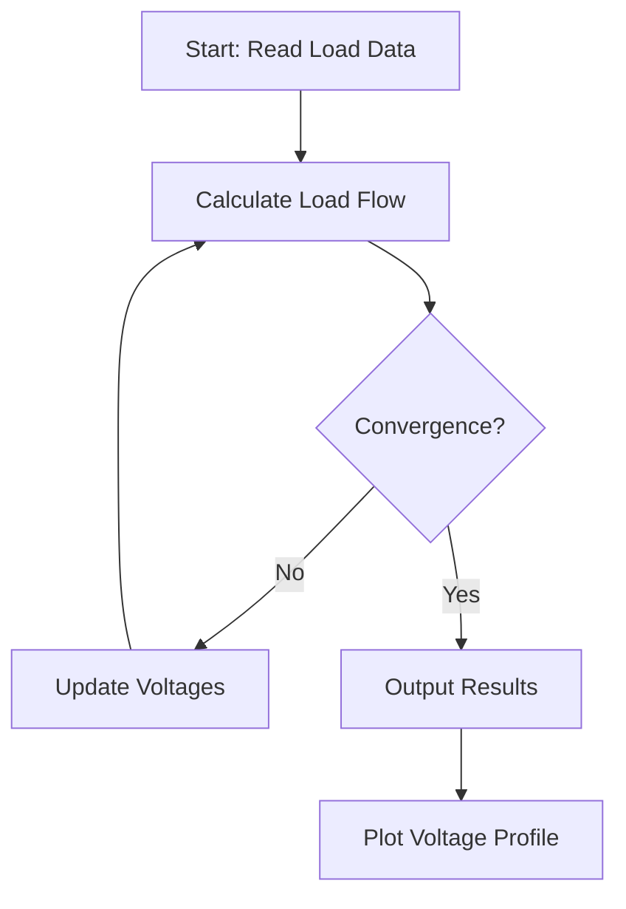
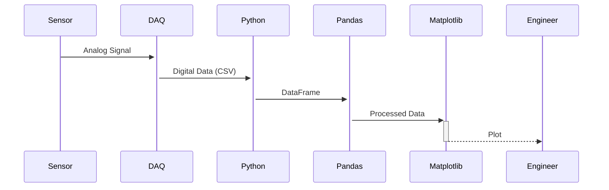
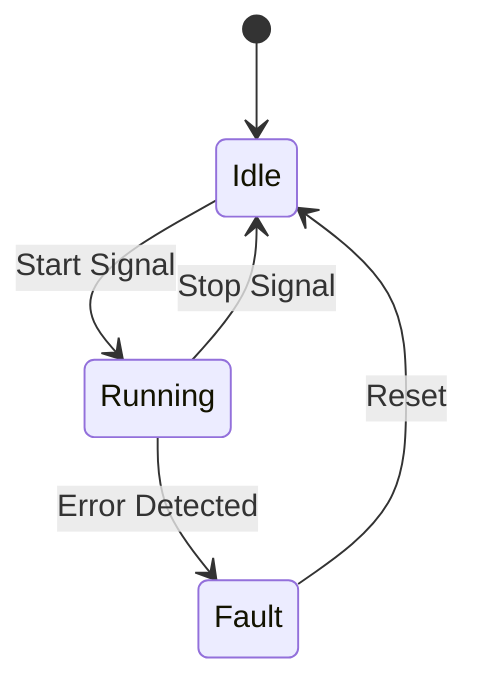
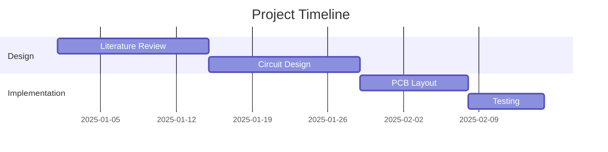

# 🚀 mlotfic.github.io — Personal Blog Setup Guide
### Chirpy Jekyll Theme · GitHub Pages · Electrical Engineering & Data Science Blog

> **Author:** Mohamed Lotfi  
> **Repo:** https://github.com/mlotfic/mlotfic.github.io  
> **LinkedIn:** https://www.linkedin.com/in/mlotfic/  
> **Live URL (after setup):** https://mlotfic.github.io

---

## 📋 Table of Contents

1. [Project File Structure](#1-project-file-structure)
2. [Prerequisites & Local Environment Setup](#2-prerequisites--local-environment-setup)
3. [Initial Chirpy Starter Setup](#3-initial-chirpy-starter-setup)
4. [Configure `_config.yml` — LinkedIn Data Import](#4-configure-_configyml--linkedin-data-import)
5. [Customize Sidebar & Avatar](#5-customize-sidebar--avatar)
6. [Built-in Tabs (Pages) — Understand & Edit](#6-built-in-tabs-pages--understand--edit)
7. [Create a Custom Tab: Resume](#7-create-a-custom-tab-resume)
8. [Writing Posts — Full Reference](#8-writing-posts--full-reference)
9. [Post Front Matter — Every Option Explained](#9-post-front-matter--every-option-explained)
10. [Categories & Tags — Hierarchical System](#10-categories--tags--hierarchical-system)
11. [Technical Notes for Electrical Engineering](#11-technical-notes-for-electrical-engineering)
12. [Technical Notes for Software Tools](#12-technical-notes-for-software-tools)
13. [Math Equations (KaTeX / MathJax)](#13-math-equations-katex--mathjax)
14. [Code Blocks & Syntax Highlighting](#14-code-blocks--syntax-highlighting)
15. [Diagrams — Mermaid, Charts, Flowcharts](#15-diagrams--mermaid-charts-flowcharts)
16. [Images, Videos & Media](#16-images-videos--media)
17. [Prompts / Callout Boxes](#17-prompts--callout-boxes)
18. [Table of Contents (TOC)](#18-table-of-contents-toc)
19. [Search, Comments & Analytics](#19-search-comments--analytics)
20. [Dark/Light Mode](#20-darklight-mode)
21. [Pin Posts to Home](#21-pin-posts-to-home)
22. [GitHub Actions — Auto Deploy](#22-github-actions--auto-deploy)
23. [Limits & Capabilities Summary](#23-limits--capabilities-summary)
24. [Quick-Start Checklist](#24-quick-start-checklist)

---

## 1. Project File Structure

```
mlotfic.github.io/
│
├── _config.yml              ← 🔑 Main site configuration (edit this first!)
├── Gemfile                  ← Ruby gem dependencies
├── Gemfile.lock             ← Locked gem versions
├── index.html               ← Home page (do NOT delete)
│
├── _posts/                  ← 📝 All blog posts go here
│   └── YYYY-MM-DD-title.md
│
├── _tabs/                   ← 🗂️ Sidebar tabs/pages
│   ├── about.md             ← About page
│   ├── archives.md          ← Auto-generated post archive
│   ├── categories.md        ← Auto-generated categories
│   └── tags.md              ← Auto-generated tags
│                            ← ➕ Add resume.md, notes.md, etc. here
│
├── _data/                   ← Data files (locales, navigation)
│   ├── locales/             ← UI language strings
│   └── origin/              ← Internal configs
│
├── _includes/               ← Reusable HTML components (advanced)
├── _layouts/                ← Page layout templates (advanced)
├── _sass/                   ← Theme styles (advanced, for customization)
│
├── assets/
│   ├── img/
│   │   ├── avatar.jpg       ← 👤 Your profile photo
│   │   ├── favicons/        ← Browser tab icons
│   │   └── posts/           ← Post images (organized by date)
│   └── js/
│
├── .github/
│   └── workflows/
│       └── pages-deploy.yml ← ⚙️ Auto-deploy to GitHub Pages
│
└── README.md
```

**Key rule:** You mainly work in:
- `_config.yml` — identity & settings
- `_posts/` — all your articles
- `_tabs/` — sidebar pages (Resume, Notes, etc.)
- `assets/img/` — all images

---

## 2. Prerequisites & Local Environment Setup

### Install Ruby + Jekyll (Windows WSL / Ubuntu / macOS)

```bash
# Ubuntu / WSL
sudo apt update
sudo apt install ruby-full build-essential zlib1g-dev

# Add Ruby gems to PATH (add to ~/.bashrc or ~/.zshrc)
echo 'export GEM_HOME="$HOME/gems"' >> ~/.bashrc
echo 'export PATH="$HOME/gems/bin:$PATH"' >> ~/.bashrc
source ~/.bashrc

# Install Jekyll & Bundler
gem install jekyll bundler
```

```bash
# macOS (using Homebrew)
brew install ruby
gem install jekyll bundler
```

```bash
# Verify
ruby -v     # should be >= 3.0
jekyll -v   # should be >= 4.3
```

### Clone your repo and install dependencies

```bash
git clone https://github.com/mlotfic/mlotfic.github.io.git
cd mlotfic.github.io
bundle install
```

### Run locally

```bash
bundle exec jekyll serve
# Open: http://localhost:4000
```

For live reload:
```bash
bundle exec jekyll serve --livereload
```

---

## 3. Initial Chirpy Starter Setup

Your repo already has `_config.yml`, `index.md`, and `README.md`.

**If `_tabs/` folder is missing**, create it:
```bash
mkdir _tabs _posts assets/img/posts
```

Then create the required tab files (see Section 6).

**Verify your `Gemfile`** contains:
```ruby
source "https://rubygems.org"
gem "jekyll-theme-chirpy", "~> 7.0"
```

Run `bundle install` after any Gemfile changes.

---

## 4. Configure `_config.yml` — LinkedIn Data Import

This is your **most important file**. Below is a complete annotated version tailored to your profile. Replace ALL `# ← EDIT` placeholders.

```yaml
# _config.yml

theme: jekyll-theme-chirpy

# ─── SITE IDENTITY ────────────────────────────────────────────────────────────
lang: en
timezone: Africa/Cairo                    # ← Your timezone (Egypt)

title: Mohamed Lotfi                      # ← Sidebar name (from LinkedIn)
tagline: Electrical Engineer & Data Scientist  # ← Your LinkedIn headline

description: >-
  Personal blog covering electrical engineering, power systems, 
  control systems, data science, Python, MATLAB, and software tools.
  Notes, tutorials, and projects by Mohamed Lotfi.

url: "https://mlotfic.github.io"
github:
  username: mlotfic                       # ← Your GitHub username

# ─── SOCIAL LINKS ─────────────────────────────────────────────────────────────
# These appear as icons in the sidebar
social:
  name: Mohamed Lotfi
  email: your.email@example.com          # ← Add your email
  links:
    - https://www.linkedin.com/in/mlotfic/
    - https://github.com/mlotfic
    # Add more: Twitter, ResearchGate, etc.

# ─── AVATAR ───────────────────────────────────────────────────────────────────
avatar: /assets/img/avatar.jpg           # ← Place your photo here

# ─── THEME PREFERENCES ────────────────────────────────────────────────────────
theme_mode:                              # [light | dark] — leave blank for auto

# ─── COMMENTS ─────────────────────────────────────────────────────────────────
comments:
  provider: giscus                       # Options: disqus | utterances | giscus
  giscus:
    repo: mlotfic/mlotfic.github.io
    repo_id:                             # ← Get from https://giscus.app
    category:
    category_id:

# ─── ANALYTICS ────────────────────────────────────────────────────────────────
analytics:
  google:
    id:                                  # ← Google Analytics Measurement ID (G-XXXXXXXX)

# ─── SEO & SHARING ────────────────────────────────────────────────────────────
google_site_verification:               # ← From Google Search Console
og_image: /assets/img/avatar.jpg

# ─── TABLE OF CONTENTS ────────────────────────────────────────────────────────
toc: true                                # Show TOC on all posts by default

# ─── PAGINATE ─────────────────────────────────────────────────────────────────
paginate: 10                             # Posts per page on home

# ─── COLLECTIONS (advanced) ───────────────────────────────────────────────────
collections:
  tabs:
    output: true
    sort_by: order

# ─── DEFAULTS ─────────────────────────────────────────────────────────────────
defaults:
  - scope:
      path: ""
      type: posts
    values:
      layout: post
      comments: true
      toc: true
      math: false               # Set true on posts needing equations
      mermaid: false            # Set true on posts needing diagrams
  - scope:
      path: "_tabs"
      type: tabs
    values:
      layout: page
      permalink: /:title/

# ─── KRAMDOWN (Markdown renderer) ─────────────────────────────────────────────
kramdown:
  footnote_backlink: "&#8617;&#xfe0e;"
  syntax_highlighter: rouge
  syntax_highlighter_opts:
    css_class: highlight
    span:
      line_numbers: false
    block:
      line_numbers: true
      start_line: 1

# ─── SASS ─────────────────────────────────────────────────────────────────────
sass:
  style: compressed

# ─── JEKYLL COMPRESS ──────────────────────────────────────────────────────────
compress_html:
  clippings: all
  comments: all
  endings: all
  profile: false
  blanklines: false
  ignore:
    envs: [development]

exclude:
  - "*.gem"
  - "*.gemspec"
  - tools
  - README.md
  - LICENSE
  - "*.config.js"
  - package*.json
```

### How to extract your LinkedIn data

1. Go to LinkedIn → **Me → Settings & Privacy → Data Privacy → Get a copy of your data**
2. Select: **Profile, Connections, Skills, Positions, Education**
3. Download the ZIP — extract and open `Profile.csv`
4. Use these fields to fill `_config.yml` and your Resume tab (Section 7):
   - `First Name` / `Last Name` → `title`
   - `Headline` → `tagline`
   - `Summary` → `about.md` content
   - `Positions` → Work Experience section
   - `Education` → Education section
   - `Skills` → Skills section

---

## 5. Customize Sidebar & Avatar

### Profile photo
```bash
# Place your photo (square, min 200×200px recommended)
cp your_photo.jpg assets/img/avatar.jpg
```

The sidebar automatically shows:
- Avatar
- Name (`title` in config)
- Tagline
- Social icons (from `social.links`)
- Navigation tabs

### Custom favicon
Go to https://realfavicongenerator.net/ → upload your avatar → download package → extract to `assets/img/favicons/`

---

## 6. Built-in Tabs (Pages) — Understand & Edit

Chirpy automatically creates these sidebar tabs from files in `_tabs/`:

| File | URL | Purpose | Auto-generated? |
|------|-----|---------|-----------------|
| `_tabs/about.md` | `/about/` | About you | ❌ You write it |
| `_tabs/archives.md` | `/archives/` | All posts by date | ✅ Auto |
| `_tabs/categories.md` | `/categories/` | Posts by category | ✅ Auto |
| `_tabs/tags.md` | `/tags/` | Posts by tag | ✅ Auto |

### How tab files work

```yaml
# _tabs/about.md
---
title: About
icon: fas fa-info-circle    # FontAwesome icon
order: 4                    # Position in sidebar (1 = top)
---

Write your content in Markdown here.
```

### Edit `_tabs/about.md` (example using LinkedIn data)

```markdown
---
title: About
icon: fas fa-user
order: 4
---

## Mohamed Lotfi

Electrical Engineer specializing in power systems, control engineering, 
and data science. I use this blog to share technical notes, tutorials, 
and project documentation across electrical engineering and software tools.

### What you'll find here
- **Electrical Engineering:** Power systems, control theory, PLC, SCADA, MATLAB/Simulink
- **Software Tools:** Python, Git, VS Code, MATLAB, LaTeX, Jupyter
- **Data Science:** Signal processing, data analysis, machine learning for engineering

[LinkedIn](https://www.linkedin.com/in/mlotfic/) · [GitHub](https://github.com/mlotfic)
```

---

## 7. Create a Custom Tab: Resume

Create `_tabs/resume.md`:

```yaml
---
title: Resume
icon: fas fa-file-alt
order: 5
---
```

Then add your full resume in Markdown. Template based on a typical electrical engineer LinkedIn profile:

```markdown
# Mohamed Lotfi
📍 Egypt  ·  🔗 [LinkedIn](https://www.linkedin.com/in/mlotfic/)  ·  🐙 [GitHub](https://github.com/mlotfic)

---

## Summary

<!-- Paste your LinkedIn Summary here -->
Electrical Engineer with expertise in [your specialization]. 
Passionate about [your key interests] and applying data-driven approaches 
to engineering problems.

---

## Work Experience

### [Job Title] · [Company Name]
**[Start Date] – [End Date]** · [City, Country]

- Key achievement or responsibility 1
- Key achievement or responsibility 2
- Tools used: MATLAB, Python, AutoCAD, etc.

### [Previous Job Title] · [Company Name]
**[Start Date] – [End Date]**

- Responsibility

---

## Education

### [Degree] in [Field]
**[University Name]** · [Year]
- Thesis: *"[Title]"*
- Relevant coursework: Power Systems, Control Theory, Signal Processing

---

## Skills

| Category | Tools & Technologies |
|----------|---------------------|
| **Electrical** | Power Systems, PLC, SCADA, AutoCAD Electrical, ETAP |
| **Simulation** | MATLAB/Simulink, PSIM, LTSpice, PSCAD |
| **Programming** | Python, MATLAB scripting, C (embedded) |
| **Data** | Pandas, NumPy, Jupyter, SQL |
| **DevOps** | Git, GitHub, Linux, Docker |
| **Office** | LaTeX, Microsoft Office, Draw.io |

---

## Certifications & Courses

| Year | Certificate | Provider |
|------|-------------|----------|
| 2024 | [Certificate Name] | [Platform] |
| 2023 | [Certificate Name] | [Platform] |

---

## Projects

### [Project Name]
**Tech:** MATLAB, Python, [other tools]

Brief description of the project, methodology, and outcome.

[GitHub Link](#) · [Demo Link](#)
```

### Add a second custom tab: Technical Notes

Create `_tabs/notes.md`:

```yaml
---
title: Notes
icon: fas fa-sticky-note
order: 6
---

## Technical Notes Index

Quick-access index of all technical notes on this blog.

### Electrical Engineering


- [{{ post.title }}]({{ post.url }}) — *{{ post.date | date: "%b %Y" }}*


### Software Tools


- [{{ post.title }}]({{ post.url }}) — *{{ post.date | date: "%b %Y" }}*

```

---

## 8. Writing Posts — Full Reference

### File naming rule (CRITICAL)

```
_posts/YYYY-MM-DD-hyphenated-title.md
```

Examples:
```
_posts/2025-02-28-pid-controller-tuning-matlab.md
_posts/2025-02-28-git-workflow-for-engineers.md
_posts/2025-01-15-power-factor-correction-tutorial.md
```

Rules:
- Date **must** match `YYYY-MM-DD` exactly
- Title: lowercase, hyphens only (no spaces, no underscores)
- File extension: `.md`

### Minimal post example

```markdown
---
title: "PID Controller Tuning in MATLAB"
date: 2025-02-28 10:00:00 +0200
categories: [Electrical Engineering, Control Systems]
tags: [matlab, pid, control-theory, simulink]
---

Your content starts here...
```

### Full post example with all features

```markdown
---
title: "Power Factor Correction: Theory, Calculation & MATLAB Simulation"
date: 2025-02-28 09:00:00 +0200
last_modified_at: 2025-03-01 12:00:00 +0200
categories: [Electrical Engineering, Power Systems]
tags: [power-factor, capacitor-banks, matlab, simulation, reactive-power]
description: "Complete guide to power factor correction with step-by-step calculations and MATLAB Simulink simulation."
image:
  path: /assets/img/posts/2025-02/power-factor-circuit.png
  alt: "Power factor correction circuit diagram"
math: true
mermaid: true
toc: true
comments: true
pin: false
---

## Introduction

Power factor (PF) is the ratio of real power to apparent power...

## Theory

The power factor is defined as:

$$\text{PF} = \cos(\phi) = \frac{P}{S} = \frac{P}{\sqrt{P^2 + Q^2}}$$

Where:
- $P$ = Real power (W)
- $Q$ = Reactive power (VAR)  
- $S$ = Apparent power (VA)

## Calculation Example

For a load with $P = 10\,\text{kW}$ and $Q = 7.5\,\text{kVAR}$:

$$S = \sqrt{10^2 + 7.5^2} = 12.5\,\text{kVA}$$

$$\text{PF} = \frac{10}{12.5} = 0.8 \text{ (lagging)}$$

## MATLAB Code

\```matlab
% Power factor correction calculation
P = 10e3;     % Real power (W)
Q = 7.5e3;    % Reactive power (VAR)
V = 230;      % Line voltage (V)
f = 50;       % Frequency (Hz)

S = sqrt(P^2 + Q^2);
PF = P / S;
fprintf('Power Factor: %.3f\n', PF);

% Required capacitance to correct to PF = 0.95
PF_target = 0.95;
Q_target = P * tan(acos(PF_target));
Q_cap = Q - Q_target;
C = Q_cap / (2 * pi * f * V^2);
fprintf('Required Capacitance: %.2f µF\n', C * 1e6);
\```

## System Flow

\```mermaid
graph LR
    A[AC Source] --> B[Load]
    B --> C{Low PF?}
    C -->|Yes| D[Add Capacitor Bank]
    D --> E[Improved PF]
    C -->|No| E
\```

## Results Summary

| Parameter | Before Correction | After Correction |
|-----------|:-----------------:|:----------------:|
| Real Power (kW) | 10 | 10 |
| Reactive Power (kVAR) | 7.5 | 3.3 |
| Apparent Power (kVA) | 12.5 | 10.5 |
| Power Factor | 0.80 | **0.95** |

> **Note:** Always verify capacitor ratings for the specific voltage and frequency.
{: #.prompt-warning }
```

---

## 9. Post Front Matter — Every Option Explained

```yaml
---
# ─── REQUIRED ──────────────────────────────────────────────────────────────────
title: "Your Post Title Here"              # Shown as H1 and in browser tab
date: 2025-02-28 09:00:00 +0200           # +0200 = Cairo time (UTC+2)

# ─── CATEGORIES (1–2 levels) ───────────────────────────────────────────────────
# Format: [Level1] or [Level1, Level2]
categories: [Electrical Engineering, Power Systems]
# Other examples:
# categories: [Software Tools, Python]
# categories: [Software Tools, Git]
# categories: [Data Science, Signal Processing]

# ─── TAGS (flat list, use kebab-case) ──────────────────────────────────────────
tags: [matlab, power-factor, simulation, tutorial]

# ─── OPTIONAL BUT RECOMMENDED ──────────────────────────────────────────────────
description: "One-sentence SEO summary of the post"    # Shown in search results
last_modified_at: 2025-03-01 10:00:00 +0200           # Update date

# ─── COVER IMAGE ───────────────────────────────────────────────────────────────
image:
  path: /assets/img/posts/2025-02/cover.png  # Post thumbnail
  alt: "Alt text for accessibility"
  lqip: data:image/webp;base64,...           # Low-quality image placeholder (optional)

# ─── FEATURES ──────────────────────────────────────────────────────────────────
math: false         # true = enable LaTeX math (KaTeX). Add per-post to save load time
mermaid: false      # true = enable Mermaid diagrams
toc: true           # true = show Table of Contents sidebar (default from _config.yml)
comments: true      # true = show comments section

# ─── HOME PAGE ─────────────────────────────────────────────────────────────────
pin: false          # true = pin this post to top of home page (max 2 recommended)

# ─── ADVANCED ──────────────────────────────────────────────────────────────────
author: mlotfic     # Override default author
render_with_liquid: false   # Disable Liquid templating (use if post has {{ }} chars)
---
```

---

## 10. Categories & Tags — Hierarchical System

### Category structure (recommended for your blog)

```
Electrical Engineering
  └── Power Systems
  └── Control Systems
  └── Circuit Design
  └── PLC & SCADA
  └── Signal Processing

Software Tools
  └── Python
  └── MATLAB
  └── Git & GitHub
  └── Linux
  └── LaTeX & Documentation

Data Science
  └── Machine Learning
  └── Data Analysis
  └── Visualization
```

### How categories map to URLs

| Front matter | URL generated |
|---|---|
| `[Electrical Engineering]` | `/categories/electrical-engineering/` |
| `[Electrical Engineering, Control Systems]` | `/categories/electrical-engineering/control-systems/` |
| `[Software Tools, Python]` | `/categories/software-tools/python/` |

### Tags vs Categories

| | Categories | Tags |
|--|--|--|
| **Levels** | 1–2 (hierarchical) | Flat list |
| **Purpose** | Broad section | Specific topics |
| **Example** | `[EE, Control]` | `pid, matlab, tuning, feedback` |
| **URL** | `/categories/...` | `/tags/pid/` |

---

## 11. Technical Notes for Electrical Engineering

### Suggested post structure for EE notes

```
_posts/
├── 2025-02-28-power-systems-load-flow-analysis.md
├── 2025-02-20-per-unit-system-explained.md
├── 2025-02-15-transformer-protection-relaying.md
├── 2025-02-10-pid-controller-tuning-methods.md
├── 2025-02-05-bode-plot-matlab-tutorial.md
├── 2025-01-30-ltspice-circuit-simulation-basics.md
├── 2025-01-25-plc-ladder-logic-basics.md
└── 2025-01-20-power-factor-correction.md
```

### Template for EE Technical Note

```markdown
---
title: "Per-Unit System: Complete Reference Guide"
date: 2025-02-20 09:00:00 +0200
categories: [Electrical Engineering, Power Systems]
tags: [per-unit, power-systems, reference, theory, calculation]
math: true
toc: true
description: "Reference guide for per-unit system normalization in power systems analysis."
image:
  path: /assets/img/posts/2025-02/per-unit-system.png
  alt: "Per-unit system diagram"
---

## Overview
<!-- 2–3 sentence summary of the topic -->

## Theory & Formulas
<!-- Use $...$ for inline math, $$...$$ for display math -->

## Worked Example
<!-- Step-by-step numerical example -->

## MATLAB / Python Implementation
<!-- Code block -->

## Key Points
<!-- Bullet list of must-remember items -->

## References
<!-- IEEE standards, textbooks, datasheets -->
```

---

## 12. Technical Notes for Software Tools

### Template for Software Tool Note

```markdown
---
title: "Git Workflow for Engineering Projects"
date: 2025-02-28 09:00:00 +0200
categories: [Software Tools, Git & GitHub]
tags: [git, version-control, workflow, terminal, engineering]
toc: true
description: "Practical Git workflow reference for engineering projects — branching, commits, and collaboration."
---

## Installation
\```bash
# Ubuntu/WSL
sudo apt install git
git config --global user.name "Mohamed Lotfi"
git config --global user.email "you@example.com"
\```

## Core Commands Reference

| Command | Description |
|---------|-------------|
| `git init` | Initialize repo |
| `git clone <url>` | Clone remote repo |
| `git add .` | Stage all changes |
| `git commit -m "msg"` | Commit staged changes |
| `git push origin main` | Push to remote |
| `git pull` | Fetch + merge remote |
| `git log --oneline` | View commit history |

## Branching Workflow
\```bash
git checkout -b feature/pid-tuning    # Create and switch to new branch
git add .
git commit -m "Add PID tuning script"
git push origin feature/pid-tuning
# Then open a Pull Request on GitHub
\```

## Common Issues & Fixes
> **Tip:** Use `git status` before every commit to review changes.
{: #.prompt-tip }
```

---

## 13. Math Equations (KaTeX / MathJax)

Enable per-post with `math: true` in front matter, or globally in `_config.yml`.

### Inline math

```markdown
The impedance is $Z = R + jX$ where $j = \sqrt{-1}$.
```

### Display math (block)

```markdown
$$
V = IZ = I(R + j\omega L) = I\left(R + j2\pi f L\right)
$$
```

### Aligned equations

```markdown
$$
\begin{aligned}
P &= VI\cos\phi \\
Q &= VI\sin\phi \\
S &= VI = \sqrt{P^2 + Q^2}
\end{aligned}
$$
```

### Matrix

```markdown
$$
\mathbf{Y}_{bus} = \begin{bmatrix}
Y_{11} & Y_{12} & Y_{13} \\
Y_{21} & Y_{22} & Y_{23} \\
Y_{31} & Y_{32} & Y_{33}
\end{bmatrix}
$$
```

### Common EE notation

```markdown
| Notation | LaTeX | Output |
|----------|-------|--------|
| Phasor | `\mathbf{V}` | **V** |
| Impedance | `Z = R + j\omega L` | Z = R + jωL |
| Laplace | `\mathcal{L}\{f(t)\}` | ℒ{f(t)} |
| Partial diff | `\frac{\partial V}{\partial t}` | ∂V/∂t |
| Summation | `\sum_{n=0}^{\infty}` | Σ |
| Integral | `\int_0^T f(t)\,dt` | ∫ |
```

---

## 14. Code Blocks & Syntax Highlighting

Supported languages (relevant to you): `matlab`, `python`, `bash`, `c`, `cpp`, `yaml`, `json`, `latex`

### Basic code block

````markdown
```matlab
% Bode plot in MATLAB
s = tf('s');
G = 1 / (s^2 + 2*s + 1);
bode(G);
grid on;
```
````

### With filename shown

````markdown
```python
# filepath: pid_controller.py
class PIDController:
    def __init__(self, kp, ki, kd):
        self.kp, self.ki, self.kd = kp, ki, kd
        self.integral = 0
        self.prev_error = 0
    
    def compute(self, setpoint, measurement, dt):
        error = setpoint - measurement
        self.integral += error * dt
        derivative = (error - self.prev_error) / dt
        self.prev_error = error
        return self.kp*error + self.ki*self.integral + self.kd*derivative
```
````

### Highlighting specific lines

````markdown
```python {: #.highlight-line data-line="3,7"}
# Line 3 and 7 will be highlighted
````

---

## 15. Diagrams — Mermaid, Charts, Flowcharts

Enable with `mermaid: true` in front matter.

### Flowchart

````markdown

````

### Sequence diagram (useful for data pipelines)

````markdown

````

### State diagram (control systems)

````markdown

````

### Gantt chart (projects)

````markdown

````

---

## 16. Images, Videos & Media

### Organize images by date

```
assets/img/posts/
├── 2025-02/
│   ├── power-factor-circuit.png
│   └── bode-plot.png
└── 2025-01/
    └── pid-response.png
```

### Basic image in post

```markdown

_Figure 1: PID controller step response_
```

### Image with caption (Chirpy style)

```markdown
{: #width="700" height="400" }
_Figure 1: RLC circuit schematic_
```

### Image sizing options

```markdown
{: #width="400" }              # Fixed width
{: #.w-50 .right }            # 50% width, float right
{: #.w-75 .left }             # 75% width, float left
{: #.shadow }                 # Drop shadow
```

### Dark/light mode images

```markdown
{: #.light }
{: #.dark }
```

### Embed YouTube video

```markdown

```

### Embed Bilibili video

```markdown

```

---

## 17. Prompts / Callout Boxes

Chirpy provides four prompt types. Syntax: add `{: #.prompt-TYPE }` after a blockquote.

```markdown
> **Tip:** Use `bundle exec jekyll serve --livereload` for hot reload during development.
{: #.prompt-tip }

> **Info:** The per-unit system simplifies multi-voltage power system calculations.
{: #.prompt-info }

> **Warning:** Always verify capacitor voltage ratings before installation.
{: #.prompt-warning }

> **Danger:** Working with high-voltage systems requires qualified personnel only.
{: #.prompt-danger }
```

**Renders as colored boxes:**
- 🟢 `.prompt-tip` — green, for tips and tricks
- 🔵 `.prompt-info` — blue, for informational notes
- 🟡 `.prompt-warning` — yellow, for cautions
- 🔴 `.prompt-danger` — red, for safety warnings

---

## 18. Table of Contents (TOC)

The TOC is **automatically generated** from your `##`, `###`, `####` headings.

- Enabled by default (`toc: true` in `_config.yml`)
- Appears as a right-side panel on desktop
- Collapses on mobile

### Disable TOC for a specific post

```yaml
---
toc: false
---
```

### TOC depth

Chirpy shows up to H4 (`####`) headings. Structure recommendation:
```markdown
## Main Section       ← H2 (appears in TOC)
### Subsection        ← H3 (appears in TOC)
#### Detail           ← H4 (appears in TOC)
```

Do NOT use H1 (`#`) in your post body — Chirpy renders the `title:` field as H1 automatically.

---

## 19. Search, Comments & Analytics

### Search
Built-in, no configuration needed. Uses [Simple Jekyll Search] — works offline.

### Comments — Giscus (GitHub Discussions, recommended)

1. Go to https://giscus.app
2. Enter your repo: `mlotfic/mlotfic.github.io`
3. Enable GitHub Discussions on the repo (Settings → Features → Discussions ✅)
4. Copy the generated `repo_id` and `category_id`
5. Paste into `_config.yml`:

```yaml
comments:
  provider: giscus
  giscus:
    repo: mlotfic/mlotfic.github.io
    repo_id: "R_xxxxxxxx"
    category: "Announcements"
    category_id: "DIC_xxxxxxxx"
    mapping: pathname
    lang: en
```

### Analytics — Google Analytics 4

1. Go to https://analytics.google.com → create property
2. Get your `G-XXXXXXXXXX` ID
3. Add to `_config.yml`:

```yaml
analytics:
  google:
    id: "G-XXXXXXXXXX"
```

---

## 20. Dark/Light Mode

Chirpy supports automatic dark/light mode based on the OS preference.

### Force a default mode

```yaml
# _config.yml
theme_mode: dark    # or: light
# Leave blank for auto (OS preference)
```

### Users can toggle
A toggle button is built into the bottom of the sidebar automatically.

---

## 21. Pin Posts to Home

Pin up to 2 posts to the top of the home feed:

```yaml
---
title: "Start Here: About This Blog"
pin: true
---
```

Recommended pins:
1. An "About This Blog / Start Here" post
2. A "Useful References" or "Index" post

---

## 22. GitHub Actions — Auto Deploy

Your repo already uses Chirpy Starter which includes a pre-built workflow. Verify `.github/workflows/pages-deploy.yml` exists.

### Setup GitHub Pages

1. Go to your repo → **Settings → Pages**
2. **Source:** `GitHub Actions` (not branch)
3. Push to `main` branch → build runs automatically
4. Site live at: `https://mlotfic.github.io`

### Check build status

Go to: `https://github.com/mlotfic/mlotfic.github.io/actions`

### Manual trigger

```bash
git add .
git commit -m "Add new post: Power Factor Correction"
git push origin main
# GitHub Actions builds and deploys automatically (~2–3 min)
```

---

## 23. Limits & Capabilities Summary

| Feature | Capability | Limit / Notes |
|---------|-----------|---------------|
| **Posts** | Unlimited | Older posts still searchable |
| **Categories** | Hierarchical, 2 levels | More than 2 levels not supported |
| **Tags** | Flat, unlimited | Shown in tag cloud |
| **Math** | KaTeX (fast) | Enable per-post: `math: true` |
| **Diagrams** | Mermaid.js | Enable per-post: `mermaid: true` |
| **Code highlighting** | Rouge (100+ languages) | Line numbers, filenames supported |
| **TOC** | Auto from headings | Up to H4 depth |
| **Search** | Client-side, instant | No server needed |
| **Comments** | Giscus/Utterances/Disqus | Giscus recommended |
| **Analytics** | Google Analytics 4 | + GoatCounter, Fathom, etc. |
| **Tabs (sidebar)** | Unlimited custom pages | Add `.md` files to `_tabs/` |
| **Images** | Any format | Organize in `assets/img/posts/` |
| **Pinned posts** | 2 recommended max | More pins push content down |
| **Dark/Light mode** | Auto + manual toggle | Built-in |
| **Multilingual UI** | Supported | Set `lang:` in `_config.yml` |
| **RSS Feed** | Auto-generated | `/feed.xml` |
| **Sitemap** | Auto-generated | `/sitemap.xml` |
| **Build time** | ~30s–2min | Depends on post count |
| **Hosting cost** | Free | GitHub Pages (public repo) |
| **Custom domain** | Supported | Add `CNAME` file + DNS record |
| **Does NOT support** | Dynamic server-side code | Static HTML only — no PHP/Node |
| **Does NOT support** | User accounts/login | No database |

---

## 24. Quick-Start Checklist

```
Setup
□ Clone repo: git clone https://github.com/mlotfic/mlotfic.github.io.git
□ Run: bundle install
□ Run: bundle exec jekyll serve --livereload
□ Open: http://localhost:4000

Identity
□ Edit _config.yml: title, tagline, description, url, email
□ Add social links (LinkedIn, GitHub)
□ Place avatar photo at assets/img/avatar.jpg
□ Generate and place favicons

Tabs
□ Edit _tabs/about.md with your bio (from LinkedIn summary)
□ Create _tabs/resume.md with work history
□ (Optional) Create _tabs/notes.md as index
□ Verify archives, categories, tags tabs exist

First Posts
□ Create _posts/YYYY-MM-DD-welcome-to-my-blog.md (pin: true)
□ Create your first EE technical note in _posts/
□ Create your first software tool note in _posts/

Features
□ Set up Giscus comments (https://giscus.app)
□ Set up Google Analytics (https://analytics.google.com)
□ Enable GitHub Discussions on repo

Deploy
□ GitHub Settings → Pages → Source: GitHub Actions
□ git add . && git commit -m "Initial blog setup" && git push
□ Check Actions tab for build status
□ Visit https://mlotfic.github.io
```

---

## 📚 References

| Resource | URL |
|----------|-----|
| Chirpy Theme Docs | https://chirpy.cotes.page |
| Chirpy GitHub Wiki | https://github.com/cotes2020/jekyll-theme-chirpy/wiki |
| Chirpy Starter Repo | https://github.com/cotes2020/chirpy-starter |
| Jekyll Documentation | https://jekyllrb.com/docs/ |
| KaTeX Functions | https://katex.org/docs/supported.html |
| Mermaid Diagrams | https://mermaid.js.org/intro/ |
| FontAwesome Icons | https://fontawesome.com/icons (for tab icons) |
| Giscus Comments | https://giscus.app |
| GitHub Pages Docs | https://docs.github.com/en/pages |
| LinkedIn Data Export | https://www.linkedin.com/settings/ → Data Privacy |

---

*Guide generated for mlotfic.github.io · Chirpy Starter v7+ · Jekyll 4.3+*
