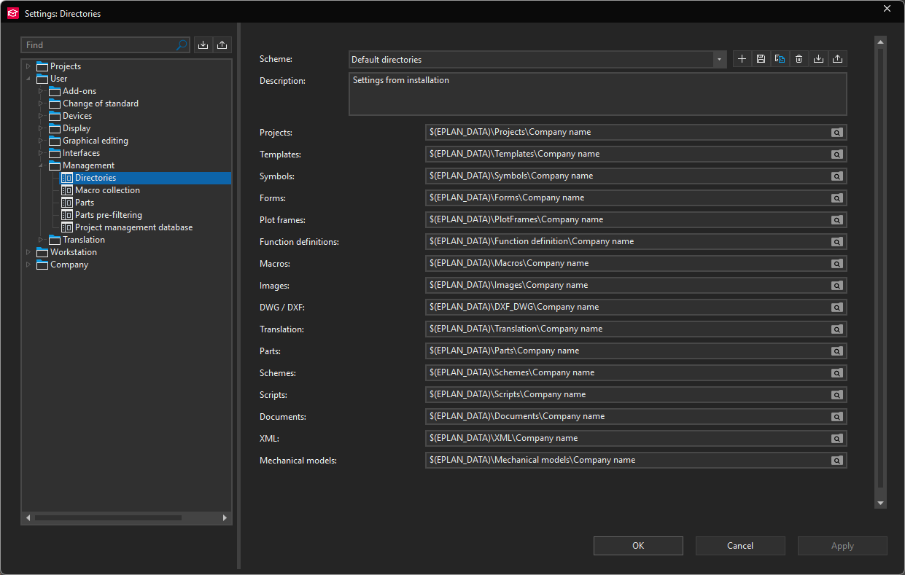
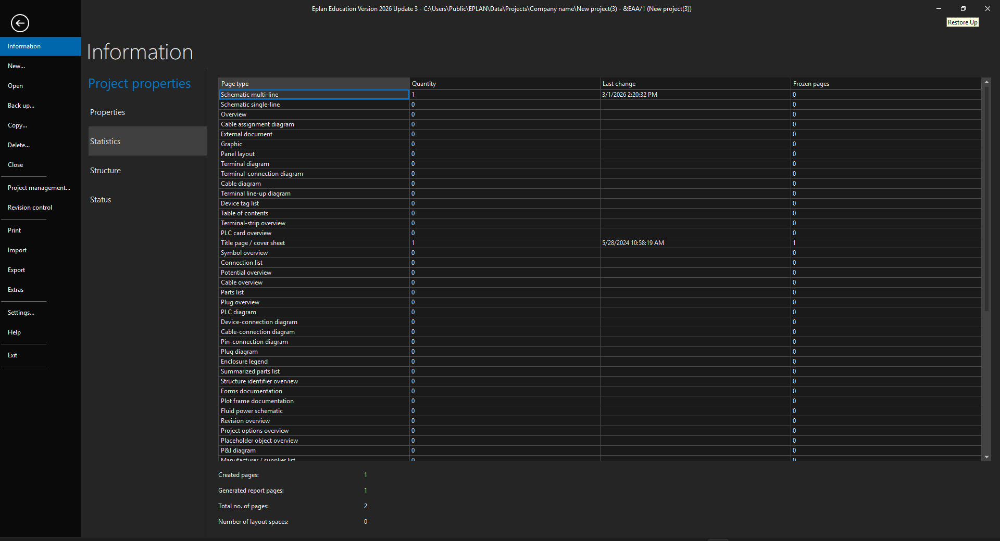
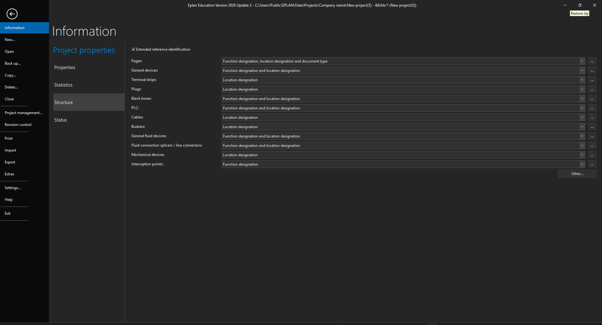
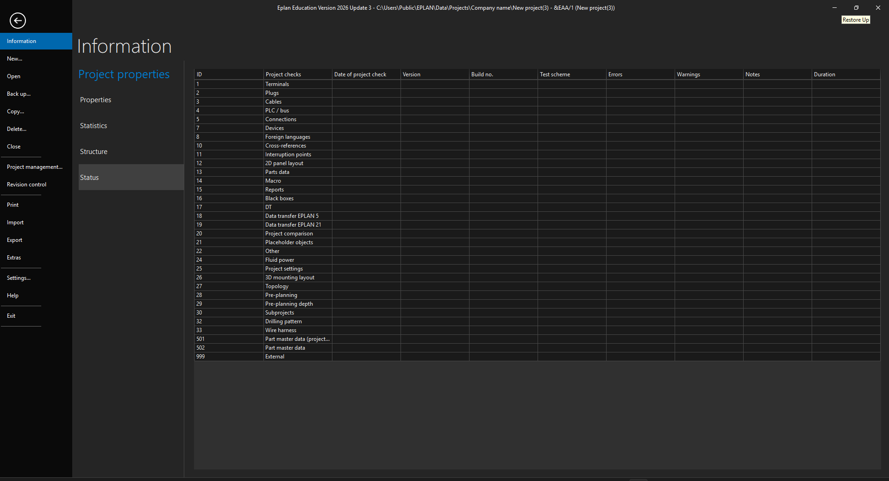
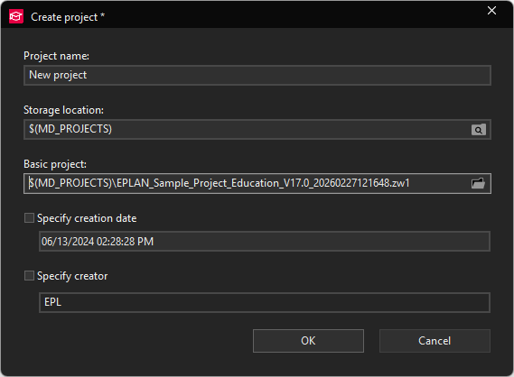
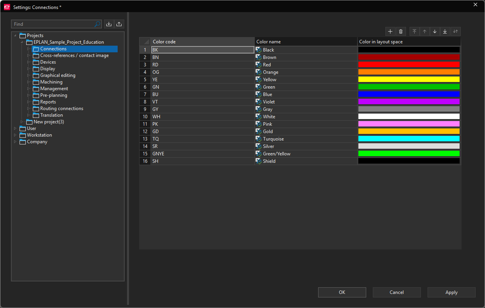

# Eplan Project

- Eplan project structure is a hierarchical organization of project pages and objects.
- It is used to organize the project in a logical and efficient manner.
- In Eplan, "Project structure" means the combination of all identifier structures used in the project for objects, pages, devices, and functions.
- All objects in a project (pages, devices, and functions) must be identified and placed in a hierarchical structure within the project.
- An hierarchically organized project structure eases the identification and location of individual objects within a project.
- Projects are structured using identifier blocks that you define in Eplan using schemes.

---

## Projects: Path

- In Eplan, schematics and attached documents such as lists and overviews are created as pages within projects.
- A project is a database in which, besides the project pages, all master data used in the project (symbols, plot frames, forms, parts data, etc.) is stored.

- Thus the project file (*.elk) belongs to a project, as well as the directory where the database and the project-related master data are stored.
- The project file represents the project; using this file you select (e.g.) a project to open or unzip.
- It contains the reference to the associated directory containing the project data.

### Comparison Project
The comparison project is the original project or the project generated without being changed from the original project. 
It contains the original project status. 
This project will be compared to the incoming project. The following projects are available as comparison projects:

```cs
*.elk: Standard project
*.elp: Zipped project
*.elr: Completed project / reference project.
*.els: Filed-off project
*.ell: Editable project / Revision project with change tracking
*.elt: Temporary project

```

**Example:**

- In the `C:\Users\Public\EPLAN\Data\Projects\Company name` directory is the `EPLAN_Sample_Project.elk` project file.


```cs
$(PROJECTPATH) = C:\Users\Public\EPLAN\Data\Projects\Company name \
$(PROJECTNAME) = EPLAN_Sample_Project
$(PROJECTPATH)\$(PROJECTNAME).elk = C:\Users\Public\EPLAN\Data\Projects\Company name\EPLAN_Sample_Project.elk

```

My workstation / Other workstations / Server:

This tree structure displays all loaded directories and the projects therein. You can filter the view using a filter scheme you define. The following icons show where the imported directories are located:

| **PROJECT LOCATION**  | **Meaning**                                                                     | **Example**                                                |
| --------------------- | ------------------------------------------------------------------------------- | ---------------------------------------------------------- |
| **My workstation**    | The directories are on your own system.                                         | **C:\Program Files\EPLAN\EPLAN\Enterprise\6756\Projects.** |
| **Server**            | The directories are on a server. They were loaded via server release            | **\\Server\EPLAN\Common projects.**                        |
| **Other workstation** | The directories are on someone else's system. The directories are not released. | **D:\Program Files\EPLAN\EPLAN\Enterprise\4567\Projects.** |

The loaded projects are displayed in alphanumeric order. Opened projects are shown with bold text. The file name extensions and icons for projects illustrate the type of project involved.

### Some project related information variable program used 

|Path variable	              | Meaning                                                                                                         |
| :-------------------------- | :-------------------------------------------------------------------------------------------------------------- |
|$(LOCALDATE)                 | Current local date.                                                                                             |
|$(LOCALTIME)                 | Current local time.                                                                                             |
|$(MD_PROJECTS)               | The directory for projects defined under Options > Settings > User >Management > Directories.                   |
|$(P)                         | Full project directory of the currently selected project.                                                       |
|$(PROJECTNAME)               | Project name of the currently selected project, without directory path and file extension.                      |
|$(PROJECTPATH)               | Full project directory of the currently selected project.                                                       |
|$(RIGHTS_DB_PATH)            | Directory of the user rights database.                                                                          |
|$(TMP)                       | The directory used by the operating system for temporary files.                                                 |

where for example:

- If the current local date is January 1, 2024, then `$(LOCALDATE)` will be replaced by “2024-01-01” (format can be influenced by the Windows region settings).
- If the current local time is 10:00 AM, then `$(LOCALTIME)` will be replaced by “10:00” or “10.00” (format can be influenced by the Windows region settings).
- If the active project is stored under `D:\EPLAN_projects\MyProject`, then `$(P)` and `$(PROJECTPATH)` will be replaced by `D:\EPLAN_projects\MyProject`.
- If the active project is named `MyProject`, then `$(PROJECTNAME)` will be replaced by `MyProject`.
- If the path to the user data directory has been set to `D:\EPLAN_userdata` under Options > Settings > User > Management > Directories, then `$(USER_DATA)` will be replaced by `D:\EPLAN_userdata`.

---

## What is master data?

Master data includes, for example, symbol libraries, plot frames, forms, macros, basic projects, parts data, the dictionary for translations, and the Eplan rights database.

> Project master data and system master data is differentiated in Eplan.



### Project master data

- Project master data is data that is used in a project.
- Project master data is stored in the project data directory.
- Project master data is used to define the properties of a project.
- Project master data is used to define the graphical representation of electronic functions.
- Project master data is used to define the default format for device tags.

### System master data

- System master data is data that is used in the system.
- System master data is stored in the system data directory.
- System master data is used to define the properties of the system.
- System master data is used to define the graphical representation of electronic functions.
- System master data is used to define the default format for device tags.

## Projects: master data folder path and structure

`C:\Users\Public\EPLAN\Data\`

```cs
Adminstration\Company name\  
Documents\Company name\
DXF_DWG\Company name\
Forms\Company name\
Function definition\Company name\
Images\Company name\
Macros\Company name\
Mechanical models\Company name\
Parts\Company name\
PlotFrames\Company name\
Projects\Company name\
Schemes\Company name\
Scripts\Company name\
Symbols\Company name\
Templates\Company name\
Translations\Company name\
XML\Company name\
```

### master data related path variables

Path variables are used to define paths to files and directories used by Eplan.

|Path variable	              | Meaning                                                                                                         |
| :-------------------------- | :-------------------------------------------------------------------------------------------------------------- |
|$(MD_DOCUMENTS)              | The directory for documents defined under Options > Settings > User > Management > Directories.                 |
|$(MD_DXFDWG)                 | The directory for DXF / DWG files defined under Options > Settings > User >Management > Directories.            |
|$(MD_FCTDEFS)                | The directory for function definitions available under Options > Settings >User > Management > Directories.     |
|$(MD_FORMS)                  | The directory for forms defined under Options > Settings > User > Management > Directories.                     |
|$(MD_FRAMES)                 | The directory for plot frames defined under Options > Settings > User >Management > Directories.                |
|$(MD_IMG)                    | The directory for images defined under Options > Settings > User > Management > Directories.                    |
|$(MD_JOBFILESERVER)          | Directory for the Batch Server files.                                                                           |
|$(MD_MACROS)                 | The directory for macros and outlines defined under Options > Settings >User > Management > Directories.        |
|$(MD_MECHANICALMODELS)       | The directory for mechanical models defined under Options > Settings >User > Management > Directories.          |
|$(MD_PARTS)                  | The directory for parts defined under Options > Settings > User >Management > Directories.                      |
|$(MD_PROJECTS)               | The directory for projects defined under Options > Settings > User >Management > Directories.                   |
|$(MD_SCHEME)                 | The directory for schemes defined under Options > Settings > User >Management > Directories.                    |
|$(MD_SCRIPTS)                | The directory for scripts defined under Options > Settings > User >Management > Directories.                    |
|$(MD_SYMBOLS)                | The directory for symbols defined under Options > Settings > User >Management > Directories.                    |
|$(MD_TEMPLATES)              | The directory for templates defined under Options > Settings > User >Management > Directories.                  |
|$(MD_TRANSLATE)              | The directory for translation files defined under Options > Settings >User > Management > Directories.          |
|$(MD_XML)                    | The directory for XML files defined under Options > Settings > User > Management > Directories.                 |

where:

- `MD` stands for **Master Data**.
- `$(EPLAN_DATA)` default location is `C:\Users\Public\EPLAN\Data\`.
- `$(MD_DOCUMENTS)` is `$(EPLAN_DATA)\Documents\Company name`.
- `$(MD_DXFDWG)` is `$(EPLAN_DATA)\DXF_DWG\Company name`.
- `$(MD_FORMS)` is `$(EPLAN_DATA)\Forms\Company name`.
- `$(MD_FCTDEFS)` is `$(EPLAN_DATA)\Function definition\Company name`.
- `$(MD_FRAMES)` is `$(EPLAN_DATA)\PlotFrames\Company name`.
- `$(MD_IMG)` is `$(EPLAN_DATA)\Images\Company name`.
- `$(MD_JOBFILESERVER)` is `$(EPLAN_DATA)\Jobfileserver\Company name`.
- `$(MD_MACROS)` is `$(EPLAN_DATA)\Macros\Company name`.
- `$(MD_MECHANICALMODELS)` is `$(EPLAN_DATA)\Mechanicalmodels\Company name`.
- `$(MD_PARTS)` is `$(EPLAN_DATA)\Parts\Company name`.
- `$(MD_PROJECTS)` is `$(EPLAN_DATA)\Projects\Company name`.
- `$(MD_SCHEME)` is `$(EPLAN_DATA)\Schemes\Company name`.
- `$(MD_SCRIPTS)` is `$(EPLAN_DATA)\Scripts\Company name`.
- `$(MD_SYMBOLS)` is `$(EPLAN_DATA)\Symbols\Company name`.
- `$(MD_TEMPLATES)` is `$(EPLAN_DATA)\Templates\Company name`.
- `$(MD_TRANSLATE)` is `$(EPLAN_DATA)\Translations\Company name`.
- `$(MD_XML)` is `$(EPLAN_DATA)\XML\Company name`.

---

## Project information

### Properties


Characteristics with a value or a setting assigned to an object. A property can have different values and / or settings for different objects of the same type. Properties influence the object, but not the system behavior. Properties are identified by numbers and can be output in forms, etc. In the program, properties are separated into different categories (e.g., Data, Settings, Formats), which can be displayed independently from one another. Depending on the current user group, different properties are visible and can be edited.

Functions
A function is an object to which a function definition (see Function definitions) is assigned. If the function is placed in the schematic (meaning represented by a symbol on a schematic page), it is also called a component. Each device can have one or more functions. For example, a contactor consists of a coil and several contacts.

### Statistics



### Project structure



In Eplan, "Project structure" means the combination of all identifier structures used in the project for objects, pages, devices, and functions. All objects in a project (pages, devices, and functions) must be identified and placed in a hierarchical structure within the project. An hierarchically organized project structure eases the identification and location of individual objects within a project.
Projects are structured using identifier blocks that you define in Eplan using schemes.

#### Defining the Project Structure

- The project structure is composed of page and device structures.
- When regarded separately, the device structure is also composed of further individual structures, for example "General devices", "Terminal strips", "Cables", "Black boxes", etc.
- Each of these structures can be separately determined by means of identifier schemes. The use of the various identifier blocks is defined in these schemes, which you fill with the appropriate structure identifiers. Eplan provides pre-defined identifier schemes. In addition to this, you can define user-defined identifier schemes for your own project structures.
- When creating a project, its page and device structure is determined by the selected basic project. In the project properties dialog you can also change page and device structure subsequently. The page structure can however only be changed later under specific conditions at a project with pages.

### Status



---

## Creating Project



---

## Project Management



---

## Data Backup: Principle

- To back up and restore, the project must be locked.
- For this reason, backups are not multi-user capable; all editors must leave the project.
- Open windows such as the graphical editor or the navigators of the project to be backed up are closed by the program; the project management and page navigator can remain open.
- Master data is also locked and can only be backed up when it is not being edited.

> Several projects can be backed up at the same time.

### The UNC naming conventions are completely supported by Eplan

This is a naming convention for the specification of the file paths:

- The names of the server and directories are included in the file path.
- "Alias" designations (such as abbreviations) are not used.
- A file path has, for example, the following form: `\\Server_name\Share_name\Directory\Subdirectory\File_name.abc`.

The backed up files are always packed (using the 7-Zip program).

- All the project data is retained during packing.
- When a project is compressed, by contrast, you can remove unused data from the project.
- The backup files have the following extensions:

| Extension | Item                            |
|-----------|---------------------------------|
| *.zw1     | Projects                        |
| *.zx1     | Basic projects with master data |
| *.zw2     | Symbol libraries                |
| *.zw3     | Plot frames                     |
| *.zw4     | Forms                           |
| *.zw5     | Macros                          |
| *.zw6     | Parts data                      |
| *.zw7     | Dictionaries                    |
| *.zw8     | User, workstation data          |
| *.zwa     | Outlines                        |

### Example

- A data backup can be opened by double-clicking the file.
- Eplan will then automatically start in Restore mode.
- The project `My_Project.elk` is backed up as `My_Project.zw1`.
- The symbol library My_Symbols.slk is backed up as My_Symbols.zw2.

### Backup of master data

- In Eplan, you can back up and restore not only complete projects, but also individual master data from the central master data pool.
- This includes basic projects, symbol libraries, plot frames, outlines, forms, macros, parts data, dictionaries as well as project-independent settings.
- In contrast to project data, individual master data cannot be filed off or archived.
- This means that a copy of the master data is always created and the original master data remains on the hard drive and can be further edited.
- Only when filing off or archiving of complete projects are the associated master data filed off or archived.

### Long-term data archiving

- For long-term archiving of projects, you should use the Eplan archiving function that creates a file in ZIP format.
- In addition to this, exports in the following database-independent formats are possible:

| Format          | Description                                                                                                                          |
| --------------- | ------------------------------------------------------------------------------------------------------------------------------------ |
| DXF / DWG       | The Drawing Exchange Format is a CAD data format for 2D and 3D data.                                                                 |
| Image file      | An image file is a file that contains an image.                                                                                      |
| PDF             | The Portable Document Format is a file format for documents that is used to present documents in a manner independent of application software, hardware, and operating systems. |

- This allows the archived data to still be analyzed even though the software and hardware environment may change over the years.
- You can export the entire project or individual pages.

---

#### ➲ **Next post:** [Path Variables](https://mlotfic.github.io/posts/eplan-path-variables)

> ⛓️‍💥 Mahmoud Lotfi
