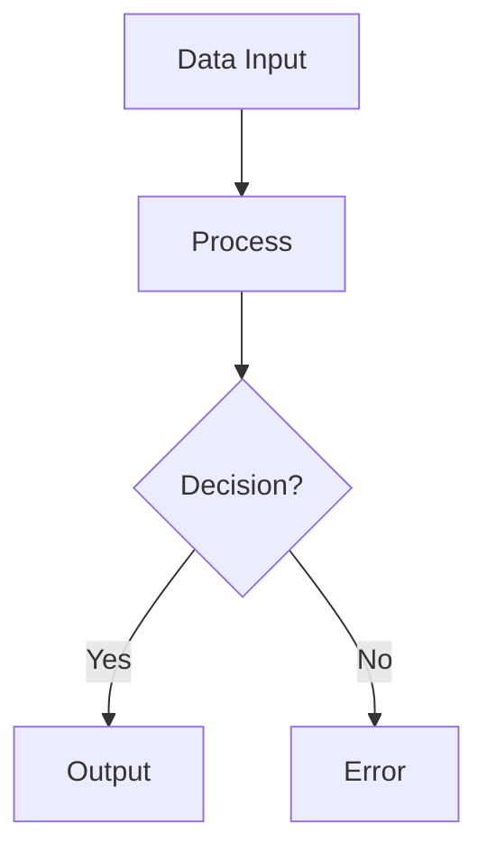
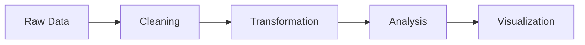

# Chirpy Jekyll Theme: Front Matter YAML Header Guide

A complete reference for all front matter fields in Chirpy posts with descriptions, use cases, and practical examples.

---

## In this file

I'll create a comprehensive guide for Chirpy Jekyll theme's front matter YAML headers with descriptions, use cases, and examples.Now I'll create a comprehensive markdown guide for Chirpy Jekyll front matter with detailed explanations and examples:Now I'll copy it to the outputs directory and present it:Perfect! I've created a comprehensive guide for Chirpy Jekyll theme front matter headers. The guide includes:

**Coverage:**
- **Core fields** (required/recommended): `title`, `author`, `date`, `categories`, `tags`
- **Enhanced fields**: `description`, `pin`, `math`, `mermaid`
- **Media fields**: `image` (with path, alt, LQIP), `media_subpath`
- **Advanced fields**: `render_with_liquid`, `comments`, `toc`

**For each field:**
- ✅ Type and default value
- ✅ Clear description of purpose
- ✅ When to use it
- ✅ Multiple practical examples (including electrical/data-focused examples)
- ✅ Best practices and tips

**Bonus sections:**
- Complete real-world examples (technical tutorial, announcement, equipment review)
- Quick reference table
- Troubleshooting guide
- Best practices summary

The guide is especially tailored to your interests in data, electrical systems, and analysis with examples around load forecasting, signal processing, circuit analysis, and equipment testing.

---

## Overview

The front matter is YAML metadata at the top of every post file (between `---` delimiters). It controls how Jekyll renders your post and how Chirpy displays it on your site.

**Basic structure:**
```yaml
---
title: Your Post Title
author: author-name
date: 2024-01-15 14:30:00 +0800
categories: [Category1, Category2]
tags: [tag1, tag2]
---
```

---

## Core Fields (Required/Recommended)

### `title`

**Type:** String  
**Required:** Yes  
**Purpose:** Displays as the main heading (H1) on your post page and in site lists.

**Description:**
The post's primary title that appears at the top of the article and in navigation/search results. This is the most prominent text associated with your post.

**When to use:**
Every post needs a title. Make it descriptive, keyword-rich, and scannable.

**Examples:**
```yaml
title: Getting Started with Chirpy Blog Framework
title: Electrical Grid Analysis: Load Forecasting Techniques
title: 5 Essential Data Visualization Patterns for Engineers
```

**Best practices:**
- Keep it under 60 characters for optimal display
- Use sentence case or title case
- Make it unique across your site

---

### `author`

**Type:** String  
**Default:** Site owner (from `_config.yml`)  
**Purpose:** Attributes the post to a specific author.

**Description:**
Identifies who wrote the post. Overrides the default site author if specified. Useful for multi-author blogs or when you want to showcase specific team members.

**When to use:**
- Multi-author blogs
- When the post author differs from site owner
- To emphasize specific expertise

**Examples:**
```yaml
author: john_smith
author: alex_chen
author: engineering_team
```

**Notes:**
- Typically matches a username or author slug (no spaces)
- If omitted, uses default author from site config
- Can be linked to author profiles if your site has them

---

### `date`

**Type:** DateTime (YAML format: `YYYY-MM-DD HH:MM:SS +/-HHMM`)  
**Required:** Yes  
**Purpose:** Sets the publication date and timezone; controls post ordering.

**Description:**
The exact date and time the post was published, including timezone offset. Jekyll uses this to sort posts chronologically. The timezone ensures accurate display across regions.

**When to use:**
Every post needs a date. Set it to when the post actually goes live, or backdate it for historical content.

**Examples:**
```yaml
date: 2024-03-15 09:30:00 +0800      # March 15, 2024, 9:30 AM, UTC+8
date: 2024-03-15 14:00:00 -0500      # Same moment, US Eastern Time
date: 2024-01-01 00:00:00 +0000      # UTC/GMT
```

**Common timezones:**
- `+0800`: China, Singapore, Malaysia
- `+0900`: Japan, South Korea
- `+0000`: UTC (GMT, London)
- `-0500`: US Eastern Time
- `-0800`: US Pacific Time

**Notes:**
- File naming convention: `YYYY-MM-DD-title.md` (date at start)
- Date in filename should match front matter date
- Posts are sorted newest-to-oldest by default
- Future-dated posts won't publish until Jekyll rebuilds

---

### `categories`

**Type:** Array of strings  
**Purpose:** Organizes posts into broad topic groups (max 2 levels).

**Description:**
A hierarchical classification system for your posts. Categories help readers navigate by topic and improve site organization. Chirpy supports up to 2 levels of hierarchy (category > subcategory).

**When to use:**
Organize posts into 5-10 main topics. Categories appear in navigation menus and breadcrumbs.

**Examples:**
```yaml
# Single category
categories: [Technical]

# Two-level hierarchy (parent > child)
categories: [Data Analysis, Time Series]
categories: [Electrical Engineering, Power Systems]
categories: [Blogging, Tutorial]

# Multiple first-level categories (rare)
categories: [Engineering, Data Science]
```

**Best practices:**
- Keep category count under 10
- Use clear, recognizable names
- Limit to 2 levels maximum
- Consistent naming across posts
- Categories should be broader than tags

**Common category structures:**
```yaml
# Technical blog
categories: [Software, Databases]
categories: [Cloud, DevOps]

# Engineering focus
categories: [Electrical, Controls]
categories: [Data, Analysis]

# Business/educational
categories: [Tutorial, Documentation]
categories: [News, Updates]
```

---

### `tags`

**Type:** Array of strings  
**Purpose:** Assigns specific keywords for fine-grained post classification.

**Description:**
Detailed labels that describe the post's specific topics. Unlike categories, tags are granular and numerous. They're useful for readers finding related content and for SEO.

**When to use:**
Add 3-8 tags per post to describe key concepts, tools, technologies, or techniques covered.

**Examples:**
```yaml
# Single tag
tags: [python]

# Multiple tags
tags: [data visualization, matplotlib, electrical engineering]
tags: [machine learning, time series forecasting, data analysis]
tags: [raspberry pi, IoT, sensors, embedded systems]
```

**Best practices:**
- Use lowercase, hyphenated tags (e.g., `machine-learning`)
- 3-8 tags per post (not too few, not too many)
- Reuse tags across posts for discovery
- Make tags specific enough to be useful
- Consider SEO and search intent

**Tag naming conventions:**
```yaml
# Good: consistent, specific, searchable
tags: [electrical-grid, power-factor, reactive-power]
tags: [data-cleaning, pandas, python]
tags: [signal-processing, fft, fourier-transform]

# Avoid: too generic or inconsistent
tags: [stuff, things, cool]           # Too vague
tags: [Python, python, PYTHON]         # Inconsistent
```

---

## Optional Enhanced Fields

### `description`

**Type:** String  
**Default:** Auto-generated from post excerpt  
**Purpose:** SEO meta description and preview text.

**Description:**
A brief summary (50-160 characters) displayed in search results and on social media previews. If omitted, Jekyll uses the first 160 characters of your post content.

**When to use:**
Always include for SEO optimization and to control how your post appears in search results and social sharing.

**Examples:**
```yaml
description: Learn how to implement load forecasting using machine learning techniques for electrical grids.

description: >-
  Get started with Chirpy basics in this comprehensive overview.
  You will learn how to install, configure, and use your first Chirpy-based website, as well as deploy it to a web server.

description: A practical guide to data analysis workflows using Python and pandas.
```

**Best practices:**
- 50-160 characters (optimal for search results)
- Include target keywords naturally
- Avoid keyword stuffing
- Make it compelling and click-worthy
- Use `>-` for multi-line descriptions (YAML folding)

**Multi-line format** (for longer descriptions):
```yaml
description: >-
  First line of description that continues
  on the next line without a line break in the output.
  Use this for comprehensive descriptions.
```

---

### `pin`

**Type:** Boolean  
**Default:** `false`  
**Purpose:** "Pins" the post to the top of the home page.

**Description:**
When set to `true`, highlights this post at the top of your blog homepage, above chronologically-sorted posts. Useful for important announcements or featured content.

**When to use:**
- Highlight a featured article
- Announce important updates or news
- Showcase your best work
- Promote timely content

**Examples:**
```yaml
pin: true     # Post appears at top of homepage

pin: false    # Normal chronological sorting (default)
```

**Notes:**
- Only one post should typically be pinned at a time
- Pinned posts still appear in chronological archives
- Use sparingly to maintain effectiveness
- Great for introductory posts or featured tutorials

---

### `math`

**Type:** Boolean  
**Default:** `false`  
**Purpose:** Enables MathJax for rendering mathematical equations.

**Description:**
Activates mathematical notation rendering using MathJax. When enabled, you can write LaTeX/MathML equations inline or as block elements.

**When to use:**
Any post containing mathematical formulas, equations, or scientific notation.

**Examples:**
```yaml
math: true    # Enable equation rendering
```

**How to use in content:**

Inline math (between `$ ... $`):
```markdown
The equation $E = mc^2$ shows mass-energy equivalence.
```

Block math (between `$$ ... $$`):
```markdown
$$
F = \frac{kq_1q_2}{r^2}
$$
```

**Common use cases:**
- Physics, engineering, mathematics posts
- Data science with statistical formulas
- Electrical analysis with complex impedance equations

**Example post:**
```yaml
---
title: Electrical Impedance Analysis
math: true
---

In AC circuits, impedance is defined as:
$$Z = R + jX = |Z|e^{j\theta}$$

where $j$ is the imaginary unit, $R$ is resistance, and $X$ is reactance.
```

---

### `mermaid`

**Type:** Boolean  
**Default:** `false`  
**Purpose:** Enables Mermaid diagram rendering.

**Description:**
Activates Mermaid.js for creating diagrams, flowcharts, sequences, and graphs from text definitions. Useful for visualizing processes, architecture, or data flows.

**When to use:**
Posts with flowcharts, UML diagrams, timeline visualizations, or process flows.

**Examples:**
```yaml
mermaid: true    # Enable diagram rendering
```

**How to use in content:**

Markdown code block with `mermaid` language identifier:
````markdown

````

**Diagram types:**
- Flowcharts
- Sequence diagrams
- Gantt charts
- Class diagrams
- State diagrams
- Git graphs

**Common use cases:**
- Workflow documentation
- System architecture
- Process flows
- Data pipeline visualization
- Algorithm flowcharts

**Example post:**
```yaml
---
title: Data Processing Pipeline
mermaid: true
---


```

---

### `image`

**Type:** Object with nested properties  
**Purpose:** Specifies post thumbnail and preview images.

**Description:**
Defines the featured/cover image displayed on the post and in previews. Includes main image path and optional Low-Quality Image Placeholder (LQIP) for faster perceived loading.

**When to use:**
Every post benefits from a featured image for visual appeal and social sharing.

**Structure:**
```yaml
image:
  path: /path/to/image.png      # Required: image path
  alt: Image description         # Recommended: alt text for accessibility
  lqip: data:image/webp;base64,UklG...  # Optional: blurred placeholder
```

**Full example:**
```yaml
image:
  path: /assets/img/posts/2024/electrical-grid-mockup.png
  alt: Electrical grid system diagram showing power distribution
  lqip: data:image/webp;base64,UklGRpoAAABXRUJQVlA4WAoAAAAQAAAADwAABwAAQUxQSDIAAAARL0AmbZurmr57yyIiqE8oiG0bejIYEQTgqiDA9vqnsUSI6H+oAERp2HZ65qP/VIAWAFZQOCBCAAAA8AEAnQEqEAAIAAVAfCWkAALp8sF8rgRgAP7o9FDvMCkMde9PK7euH5M1m6VWoDXf2FkP3BqV0ZYbO6NA/VFIAAAA
```

**Properties:**

#### `path`
- **Type:** String (required)
- **Purpose:** URL or file path to the image
- **Location:** Typically in `/assets/img/` or `/commons/`
- **Formats:** PNG, JPG, WebP

```yaml
path: /assets/img/posts/electrical-analysis.png
path: /commons/devices-mockup.png
path: https://example.com/image.png
```

#### `alt`
- **Type:** String (recommended)
- **Purpose:** Alternative text for accessibility and SEO
- **Best practice:** Descriptive, 5-15 words
- **Importance:** Helps screen readers and improves SEO

```yaml
alt: Circuit diagram showing voltage divider network
alt: Data visualization dashboard with multiple charts
alt: Three smartphones showing responsive design of blog theme
```

#### `lqip` (Low-Quality Image Placeholder)
- **Type:** String (optional)
- **Purpose:** Base64-encoded blurred image shown while main image loads
- **Benefit:** Improves perceived performance
- **Generation:** Use online tools or ImageMagick

```yaml
lqip: data:image/webp;base64,UklGRpoAAABXRUJQVlA4...
```

**Generating LQIP:**

Using ImageMagick (blur and resize to ~30px width):
```bash
convert original.png -resize 30x -quality 50 -blur 0x8 lqip.webp
base64 lqip.webp | tr -d '\n'
```

**Image recommendations:**
- **Size:** 1200x800px minimum (16:9 aspect ratio)
- **Format:** WebP (best compression) or PNG/JPG fallback
- **File size:** < 500KB for main image, < 10KB for LQIP
- **Content:** Clear, relevant to post topic

**Example with all properties:**
```yaml
---
title: Advanced Signal Processing Techniques
categories: [Electrical, Signal Processing]
tags: [fft, digital filtering, data analysis]
image:
  path: /assets/img/posts/signal-processing.png
  alt: Frequency spectrum showing FFT analysis of electrical signal
  lqip: data:image/webp;base64,UklGRjoAAABXRUJQVlA4IC4AAAA...
---
```

---

### `media_subpath`

**Type:** String  
**Default:** `/` (root of site)  
**Purpose:** Sets base path for relative image/media references in post content.

**Description:**
Defines a common directory prefix for media embedded in the post. Simplifies writing content by allowing relative paths instead of full paths.

**When to use:**
Organize post-specific assets in subdirectories (e.g., one directory per post date or topic).

**Examples:**
```yaml
# Post media stored in /posts/2024/03/15/
media_subpath: '/posts/2024/03/15'

# Post media stored by topic
media_subpath: '/posts/electrical-grid-analysis'

# Post media stored by date
media_subpath: '/posts/20240315'
```

**How it works:**

With `media_subpath: '/posts/2024/03/15'`, this markdown:
```markdown

```

Resolves to: `/posts/2024/03/15/voltage-plot.png`

Without `media_subpath`, you'd need to write the full path:
```markdown

```

**Recommended structure:**
```
assets/img/
├── posts/
│   ├── 20240315/
│   │   ├── voltage-curve.png
│   │   └── frequency-response.png
│   └── 20240320/
│       ├── circuit-diagram.png
│       └── measurement-data.png
```

**In your post front matter:**
```yaml
---
title: AC Circuit Analysis
date: 2024-03-15 10:00:00 +0800
media_subpath: '/posts/20240315'
---

# Post content
    # Resolves to /posts/20240315/voltage-curve.png
        # Resolves to /posts/20240315/circuit-diagram.png
```

---

### `render_with_liquid`

**Type:** Boolean  
**Default:** `true` (in Chirpy)  
**Purpose:** Controls whether Jekyll processes Liquid template syntax in the post.

**Description:**
When enabled, Jekyll processes Liquid variables, tags, and filters (e.g., `{{ site.baseurl }}`, ``). Disable when your post content includes literal Liquid code that shouldn't be interpreted.

**When to use:**
- Set to `false` when showing Liquid code examples
- Keep default `true` for normal posts
- Essential when documenting Jekyll/Liquid itself

**Examples:**
```yaml
# Post contains Liquid code examples - don't process them
render_with_liquid: false

# Normal blog post - process Liquid (default)
render_with_liquid: true
# OR just omit it
```

**Common scenarios:**

**Scenario 1: Documenting Liquid syntax**
```yaml
---
title: Jekyll Liquid Template Tutorial
render_with_liquid: false    # MUST be false!
---

In your templates, use:
{{ post.title }}
...
```

Without `render_with_liquid: false`, Jekyll would try to interpret those Liquid tags!

**Scenario 2: Normal blog post**
```yaml
---
title: Getting Started with Jekyll
# render_with_liquid: true (default, can omit)
---

My blog is built with Jekyll, hosted at {{ site.url }}.
```

---

## Advanced Fields

### `comments`

**Type:** Boolean  
**Default:** Depends on site config  
**Purpose:** Controls whether comment sections appear on the post.

**Description:**
Enables or disables comments on a per-post basis. Useful for announcements, pinned posts, or sensitive content where you want to disable discussion.

**When to use:**
- Disable for announcements or official notices
- Enable for tutorials where discussion is valuable
- Can be set site-wide in `_config.yml`, overridden per-post

**Examples:**
```yaml
comments: true      # Enable comments on this post

comments: false     # Disable comments (no discussion section)
```

**Default behavior:**
If omitted, uses the site-wide setting from `_config.yml`:
```yaml
# _config.yml
comments:
  active: disqus    # or giscus, utterances, etc.
```

---

### `toc`

**Type:** Boolean  
**Default:** `true`  
**Purpose:** Displays a table of contents sidebar for the post.

**Description:**
Auto-generates a table of contents from your post's headings (H2, H3, H4). Readers can jump to sections. Improves navigation for longer posts.

**When to use:**
- Disable for very short posts (< 500 words)
- Enable for tutorials, guides, and long-form content
- Improves user experience for technical posts

**Examples:**
```yaml
toc: true       # Show table of contents (default)

toc: false      # Hide table of contents
```

**TOC structure example:**

Post with headings:
```markdown
## Introduction
## Setup
### Installation
### Configuration
## Usage
### Basic Example
### Advanced Example
## Conclusion
```

Auto-generated TOC sidebar:
```
Contents
├── Introduction
├── Setup
│   ├── Installation
│   └── Configuration
├── Usage
│   ├── Basic Example
│   └── Advanced Example
└── Conclusion
```

**Best practices:**
- Use only one H1 (title) per post
- Use H2 for major sections
- Use H3 for subsections
- Include TOC on posts > 1000 words
- Keep section count under 15

---

## Complete Examples

### Technical Tutorial Example

```yaml
---
title: Load Forecasting for Electrical Grids Using Machine Learning
description: >-
  Practical guide to implementing time-series forecasting models
  for electrical load prediction. Covers data preprocessing, feature
  engineering, and model evaluation using Python.

author: data_engineer
date: 2024-03-15 09:30:00 +0800

categories: [Data Analysis, Electrical Engineering]
tags: [machine-learning, time-series, forecasting, python, pandas, scikit-learn]

pin: false
comments: true
toc: true
math: true
mermaid: true

media_subpath: '/posts/2024/03/15'

image:
  path: /assets/img/posts/load-forecasting.png
  alt: Time-series plot showing electrical load predictions vs actual values
  lqip: data:image/webp;base64,UklGRjoAAABXRUJQVlA4...
---
```

### Product Announcement Example

```yaml
---
title: Announcing Chirpy Blog Theme v6.0
description: Major update with improved performance, dark mode, and new features.
author: admin
date: 2024-03-20 14:00:00 +0800

categories: [Announcements]
tags: [chirpy, jekyll, update]

pin: true
comments: false
toc: false

image:
  path: /assets/img/posts/chirpy-v6-release.png
  alt: Chirpy v6.0 release announcement banner
---
```

### Equipment Review Example

```yaml
---
title: Testing the Fluke 87V Multimeter for Electrical Field Work
description: In-depth review and practical testing of the Fluke 87V digital multimeter for professional electrical diagnostics.

author: field_engineer
date: 2024-02-10 16:45:00 +0800

categories: [Equipment Reviews, Electrical]
tags: [multimeter, fluke, testing, measurements, field-work]

pin: false
comments: true
toc: true
math: false
mermaid: false

media_subpath: '/posts/equipment-reviews/fluke-87v'

image:
  path: /assets/img/posts/fluke-multimeter.jpg
  alt: Fluke 87V digital multimeter display showing voltage measurement
---
```

---

## Quick Reference Table

| Field | Type | Required | Purpose |
|-------|------|----------|---------|
| `title` | String | Yes | Post heading |
| `author` | String | No | Post attribution |
| `date` | DateTime | Yes | Publication date & timezone |
| `categories` | Array | Yes | Broad topic classification |
| `tags` | Array | No | Specific keywords |
| `description` | String | No | SEO meta description |
| `pin` | Boolean | No | Feature on homepage |
| `math` | Boolean | No | Enable LaTeX equations |
| `mermaid` | Boolean | No | Enable diagrams |
| `image` | Object | No | Featured image & LQIP |
| `media_subpath` | String | No | Media directory prefix |
| `render_with_liquid` | Boolean | No | Process Liquid syntax |
| `comments` | Boolean | No | Enable comments |
| `toc` | Boolean | No | Show table of contents |

---

## Best Practices Summary

1. **Always include:** `title`, `date`, `categories`
2. **Highly recommended:** `description`, `image`, `author`
3. **Use for clarity:** `tags` (3-8 per post), `toc` (for long posts)
4. **Use when needed:** `math`, `mermaid`, `media_subpath`
5. **Control visibility:** `pin`, `comments`
6. **Technical docs:** `render_with_liquid: false`

**SEO tips:**
- Write compelling descriptions (50-160 chars)
- Use keywords naturally in title and tags
- Include relevant images
- Link to related posts

**Organization tips:**
- Keep categories consistent (5-10 max)
- Build reusable tag vocabulary
- Use media_subpath for organized assets
- Pin your best content

---

## Troubleshooting

**Post not appearing:**
- Check date isn't in the future
- Verify YAML syntax (no tabs, proper indentation)
- Ensure categories array syntax: `[Category]` not `Category`

**Images not loading:**
- Check `path` is absolute (starts with `/`)
- Verify image file exists
- Test with full URL if using `media_subpath`

**Equations not rendering:**
- Ensure `math: true`
- Use `$ ... $` for inline, `$$ ... $$` for blocks
- Check LaTeX syntax (use `\\` for backslash in markdown)

**Diagrams not appearing:**
- Ensure `mermaid: true`
- Verify code block is marked with `` ```mermaid ``
- Check diagram syntax in Mermaid documentation
