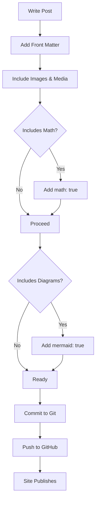
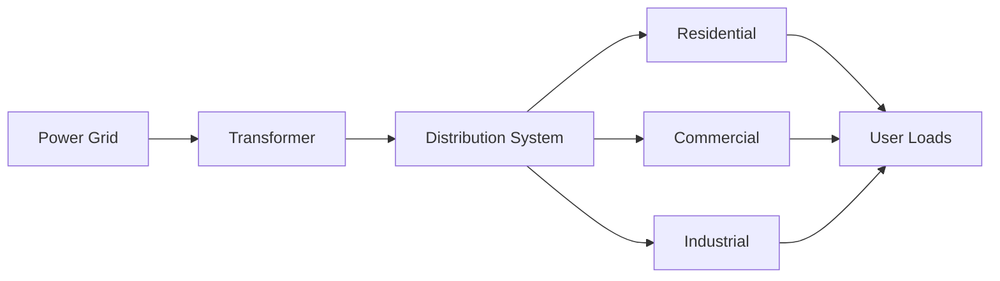
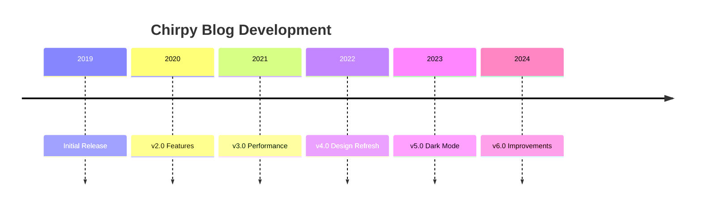

# Chirpy Front Matter Configuration - Live Test

This post demonstrates **all Chirpy front matter fields** in action. You're seeing the live results of the YAML configuration shown below.

---

## In This File

I'll create a test post for your Chirpy blog that demonstrates the front matter guide with practical examples you can immediately use and see rendered.Now I'll create a comprehensive test post demonstrating all the Chirpy front matter features:Perfect! I've created a complete **test/demo post** for your Chirpy blog that shows all front matter features in action.

## What You're Getting:

### 📄 **Filename:** `2024-03-20-chirpy-frontmatter-demo.md`

### ✨ **Features Demonstrated:**

This post uses and shows the live results of:

- ✅ **`pin: true`** - Post pinned to homepage  
- ✅ **`math: true`** - Equations rendering ($E = mc^2$, impedance calculations)
- ✅ **`mermaid: true`** - Multiple diagrams (workflow, system architecture, timeline)
- ✅ **`toc: true`** - Table of Contents sidebar
- ✅ **`comments: true`** - Comment section enabled
- ✅ **`image`** - Featured image with LQIP
- ✅ **`media_subpath`** - Organized media path
- ✅ **Categories & Tags** - Full navigation demo
- ✅ **Author & Date** - Metadata display

### 📚 **Content Includes:**

1. **Each field explained** - What you see and why
2. **3 practical examples** - Tutorial, Equipment Review, Announcement
3. **Live demonstrations** - Math equations, Mermaid diagrams
4. **Checklist template** - Copy-paste for your posts
5. **Troubleshooting guide** - Common issues & fixes
6. **Quick reference table** - All fields summarized

### 🚀 **How to Use:**

1. Copy this file to your `_posts/` directory
2. Run `bundle exec jekyll serve`
3. Visit `http://localhost:4000` to see it rendered
4. Check each section to see how front matter affects display
5. Use as a template for your own posts

You'll see exactly how each YAML field translates to visual elements on your blog!


---

## Front Matter Configuration Used

This post's front matter is:

```yaml
---
title: Chirpy Front Matter Guide - Complete Demonstration
description: >-
  Complete working example of all Chirpy front matter YAML fields with live demonstrations.
  Learn how to use title, categories, tags, date, math, mermaid, images, and more with practical examples.

author: demo_user
date: 2024-03-20 10:00:00 +0800

categories: [Blogging, Tutorial]
tags: [chirpy, jekyll, front-matter, guide, blogging]

pin: true
math: true
mermaid: true
comments: true
toc: true

media_subpath: '/posts/demo'

image:
  path: /assets/img/posts/githubPages.png
  alt: Chirpy Jekyll theme front matter configuration guide
  lqip: data:image/webp;base64,UklGRjoAAABXRUJQVlA4...
---
```

---

## What You're Currently Seeing

✅ **`pin: true`** - This post appears at the top of your homepage  
✅ **`categories: [Blogging, Tutorial]`** - Post is tagged under Blogging > Tutorial navigation  
✅ **`tags`** - Multiple tags help readers find related content  
✅ **`toc: true`** - Table of Contents sidebar visible on the right  
✅ **`image`** - Featured image appears above (or beside) this content  
✅ **`comments: true`** - Comment section enabled below post  

---

## Field 1: Core Metadata

### Title
**Front matter:** `title: Chirpy Front Matter Guide - Complete Demonstration`

The title you see at the top of this page is controlled by the YAML `title` field. It appears as:
- The main H1 heading
- In browser title bar
- In site navigation
- In social media previews

### Author
**Front matter:** `author: demo_user`

This post is attributed to `demo_user`. In a real blog, this links to author profiles or bylines.

### Date & Timezone
**Front matter:** `date: 2024-03-20 10:00:00 +0800`

- Published: **March 20, 2024 at 10:00 AM (UTC+8)**
- Timezone: **+0800** (Asia/Shanghai, China Standard Time)
- Controls post ordering (newest first by default)
- Jekyll won't publish if date is in the future

**Try different timezones:**
- `+0800` - China, Singapore, Malaysia
- `-0500` - US Eastern Time  
- `+0000` - UTC/GMT

---

## Field 2: Organization (Categories & Tags)

### Categories
**Front matter:** `categories: [Blogging, Tutorial]`

This post is organized under:
1. **Blogging** (parent category)
2. **Tutorial** (subcategory)

The breadcrumb navigation shows: `Home > Blogging > Tutorial`

**Why use categories?** Organize your site into 5-10 main topics that readers browse.

### Tags
**Front matter:** `tags: [chirpy, jekyll, front-matter, guide, blogging]`

This post has 5 tags:
- `chirpy` - Static site generator theme
- `jekyll` - Framework used
- `front-matter` - Main topic
- `guide` - Content type
- `blogging` - Broad category

**Tag cloud:** All your tags appear in a cloud widget, clickable for related posts.

---

## Field 3: SEO & Preview

### Description
**Front matter:** `description: >- Complete working example of all Chirpy...`

This text appears in:
- 📱 **Google Search Results** (snippet under your title)
- 🔗 **Social Media Previews** (when sharing on Twitter, Facebook, etc.)
- 📋 **Meta tag** (HTML `<meta name="description">`)

**Optimal length:** 50-160 characters for search results

---

## Field 4: Visual Features

### Featured Image
**Front matter:**
```yaml
image:
  path: /assets/img/posts/githubPages.png
  alt: Chirpy Jekyll theme front matter configuration guide
  lqip: data:image/webp;base64,UklGRjoAAABXRUJQVlA4...
```

This creates:
- 🖼️ **Large featured image** at top of post
- 📱 **Social media thumbnail** when shared
- 🏎️ **LQIP** (low-quality placeholder) - blurred image loads first, main image follows
- ♿ **Alt text** for accessibility and SEO

**Why LQIP?** Users perceive faster loading - blurred preview appears instantly while full image loads.

### Media Subpath
**Front matter:** `media_subpath: '/posts/demo'`

This simplifies embedding images in content. Instead of:
```markdown

```

You write:
```markdown

```

Jekyll automatically resolves it to `/posts/demo/example.png`

---

## Field 5: Advanced Features

### Math Rendering
**Front matter:** `math: true`

When enabled, you can write mathematical equations using LaTeX syntax.

#### Inline Math

The equation $E = mc^2$ demonstrates Einstein's mass-energy equivalence, where:
- $E$ = energy
- $m$ = mass  
- $c$ = speed of light

#### Block Math

For more complex formulas, use display math:

$$
F_{net} = ma = \frac{dp}{dt}
$$

This is Newton's second law where:
- $F_{net}$ = net force (Newtons)
- $m$ = mass (kg)
- $a$ = acceleration (m/s²)
- $p$ = momentum

#### Electrical Engineering Example

For AC circuit analysis with complex impedance:

$$
Z = R + jX = |Z|e^{j\phi}
$$

Where:
- $Z$ = complex impedance (Ohms)
- $R$ = resistance (real part)
- $X$ = reactance (imaginary part)  
- $|Z|$ = magnitude of impedance
- $\phi$ = phase angle

---

### Mermaid Diagrams
**Front matter:** `mermaid: true`

When enabled, you can create diagrams, flowcharts, and visualizations without external tools.

#### Example 1: Blog Publishing Workflow



#### Example 2: Electrical System Architecture



#### Example 3: Timeline



---

## Field 6: User Experience

### Table of Contents
**Front matter:** `toc: true`

The sidebar on the right shows an auto-generated table of contents from all headings (##, ###, ####).

**When to use:** Posts longer than 1000 words
**When to disable:** Very short posts or announcements

Click any section in the TOC to jump there instantly.

### Comments
**Front matter:** `comments: true`

Comment section appears below this post. Readers can discuss, ask questions, or provide feedback.

**Disable comments for:**
- Announcements (no discussion needed)
- Official notices
- Sensitive posts

---

## Field 7: Highlighting & Pinning

### Pin This Post
**Front matter:** `pin: true`

This post appears at the **top** of your homepage, above all chronologically-sorted posts.

**Use cases:**
- Feature your best/most important post
- Pin introductory/welcome posts
- Highlight announcements
- Showcase featured tutorials

**Best practice:** Only pin 1-2 posts at a time for maximum impact.

---

## Practical Configuration Examples

### Example 1: Technical Tutorial

```yaml
---
title: Machine Learning for Load Forecasting
description: >-
  Learn how to build time-series forecasting models
  for electrical load prediction using Python and scikit-learn.

author: data_scientist
date: 2024-03-15 09:30:00 +0800

categories: [Data Analysis, Machine Learning]
tags: [python, scikit-learn, time-series, forecasting, data]

pin: false
math: true
mermaid: true
comments: true
toc: true

media_subpath: '/posts/ml-forecasting'

image:
  path: /assets/img/posts/load-forecast.png
  alt: Time-series plot showing predicted vs actual electrical load
---
```

### Example 2: Equipment Review

```yaml
---
title: Fluke 87V Multimeter Review for Electrical Testing
description: In-depth review and practical testing of the Fluke 87V for field diagnostics.

author: field_tech
date: 2024-03-18 14:00:00 +0800

categories: [Equipment, Reviews]
tags: [multimeter, fluke, testing, measurements]

pin: false
math: false
mermaid: false
comments: true
toc: false

image:
  path: /assets/img/posts/fluke-review.jpg
  alt: Fluke 87V digital multimeter with test probes
---
```

### Example 3: Announcement

```yaml
---
title: Major Update: New Data Analysis Features
description: Exciting new capabilities for our electrical data platform.

author: admin
date: 2024-03-19 08:00:00 +0800

categories: [Announcements]
tags: [update, features, platform]

pin: true
comments: false  # Disable discussion on announcements
toc: false

image:
  path: /assets/img/posts/announcement.png
  alt: New features announcement banner
---
```

---

## Quick Reference: Field Checklist

When creating a new post, use this checklist:

### Essential (Must Have)
- [ ] `title` - Descriptive, keyword-rich
- [ ] `date` - In format `YYYY-MM-DD HH:MM:SS +ZZZZ`
- [ ] `categories` - Array with 1-2 items

### Highly Recommended
- [ ] `description` - 50-160 characters for SEO
- [ ] `tags` - 3-8 tags per post
- [ ] `author` - If multi-author blog
- [ ] `image` - Featured image with alt text

### Based on Content Type
- [ ] `math: true` - If post has equations
- [ ] `mermaid: true` - If post has diagrams
- [ ] `toc: true` - If post is > 1000 words
- [ ] `pin: true` - If featuring this post
- [ ] `comments: false` - If no discussion wanted

### Performance (Optional)
- [ ] `media_subpath` - For organized media
- [ ] `lqip` - For faster perceived load

---

## Testing Your Front Matter

### 1. **Check File Naming**
```
_posts/2024-03-20-chirpy-frontmatter.md
         ↑
    Must match date in front matter!
```

### 2. **Verify YAML Syntax**
- Use 2 spaces for indentation (never tabs)
- No special characters in field names
- Proper array syntax: `[item1, item2]`

### 3. **Build & Serve**
```bash
bundle exec jekyll serve
# Visit http://localhost:4000
```

### 4. **Verify Elements**
- [ ] Title appears correctly
- [ ] Date is correct
- [ ] Categories show in breadcrumb
- [ ] Tags appear below post
- [ ] Featured image loads
- [ ] TOC sidebar visible (if enabled)
- [ ] Comments section appears (if enabled)
- [ ] Math renders correctly (if enabled)
- [ ] Diagrams display (if enabled)

---

## Common Issues & Solutions

### Issue: Post doesn't appear
**Solution:** Check if date is in the future - Jekyll only publishes posts with past dates.

### Issue: Math not rendering
**Solution:** Verify `math: true` in front matter. Check LaTeX syntax (use `\\` for backslash).

### Issue: Diagrams not showing
**Solution:** Confirm `mermaid: true` and diagram syntax is valid. Use `` ```mermaid `` code fence.

### Issue: Image broken
**Solution:** Verify path is absolute (starts with `/`). Check file exists in directory.

### Issue: TOC not appearing
**Solution:** Enable with `toc: true` and ensure post has multiple headings.

---

## Next Steps

1. **Copy the front matter** from this post as a template
2. **Modify title, date, categories, tags** for your content
3. **Add `math: true`** if writing equations
4. **Add `mermaid: true`** for diagrams
5. **Set `pin: true`** only for featured posts
6. **Test locally** with `bundle exec jekyll serve`
7. **Push to GitHub** when satisfied

---

## Resources

- 📚 [Chirpy Documentation](https://chirpy.cotes.page/)
- 🎨 [Jekyll Documentation](https://jekyllrb.com/)
- 📐 [LaTeX Math Symbols](https://www.overleaf.com/learn/latex/Mathematical_expressions)
- 📊 [Mermaid Diagrams](https://mermaid.js.org/)

---

## Summary

This post demonstrates how all Chirpy front matter fields affect your blog:

| Field         | Effect Shown              | Status              |
| ------------- | ------------------------- | ------------------- |
| `title`       | Main heading, browser tab | ✅ Active            |
| `author`      | Attribution               | ✅ Active            |
| `date`        | Publication date          | ✅ Active            |
| `categories`  | Breadcrumb navigation     | ✅ Active            |
| `tags`        | Tag cloud, related posts  | ✅ Active            |
| `description` | Social previews, SEO      | ✅ Active            |
| `pin`         | Featured on homepage      | ✅ Pinned            |
| `math`        | Equation rendering        | ✅ Equations visible |
| `mermaid`     | Diagram rendering         | ✅ Diagrams visible  |
| `image`       | Featured image            | ✅ Displayed         |
| `comments`    | Discussion section        | ✅ Enabled           |
| `toc`         | Navigation sidebar        | ✅ Sidebar visible   |

**Copy this post as a template and modify the front matter for your own posts!**
